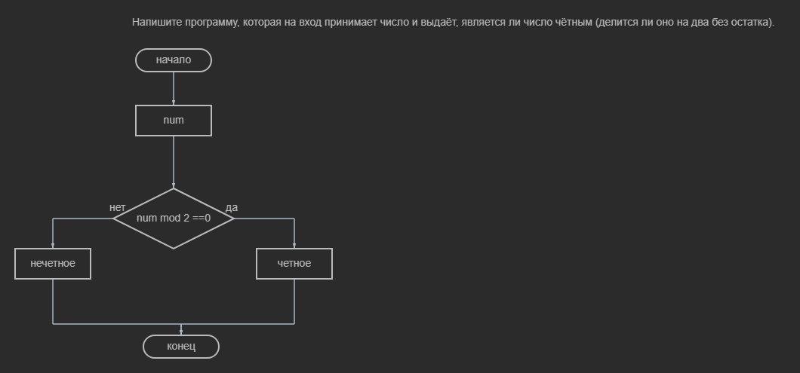
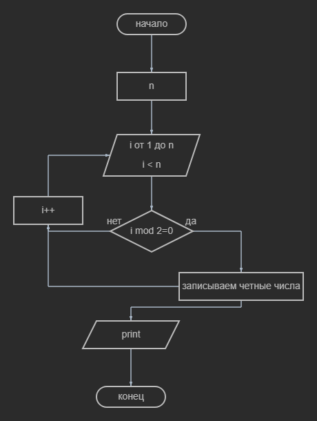

# Напишите программу, которая на вход принимает два числа и выдаёт, какое число большее, а какое меньшее.
 Блок схема 1 задание Код 1 задания [HW01/Program.cs) ](HW01/Program.cs) 

 # Напишите программу, которая принимает на вход три числа и выдаёт максимальное из этих чисел.
  Блок схема 2 задание Код 2 задания [HW2/Program.cs](HW2/Program.cs) 
  
  #  Напишите программу, которая на вход принимает число и выдаёт, является ли число чётным (делится ли оно на два без остатка).
  Блок схема 3 заданиz Код 3 задания [HW03/Program.cs](HW03/Program.cs) 

  #Напишите программу, которая на вход принимает число (N), а на выходе показывает все чётные числа от 1 до N.
  Блок схема 4 задания  Код  4 задания [HW04/Program.cs](HW04/Program.cs) 