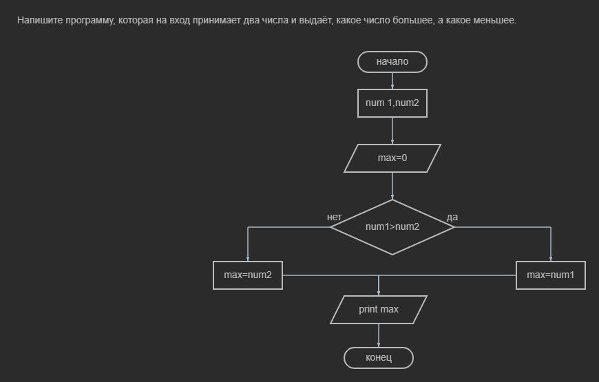
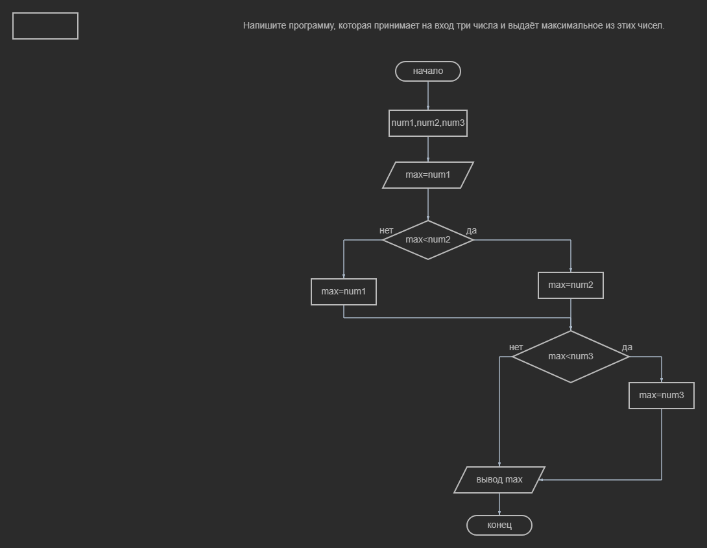

# Напишите программу, которая на вход принимает два числа и выдаёт, какое число большее, а какое меньшее.
 Блок схема 1 задание Код 1 задания [HW01/Program.cs) ](HW01/Program.cs) 

 # Напишите программу, которая принимает на вход три числа и выдаёт максимальное из этих чисел.
  Блок схема 2 задание Код 2 задания [HW2/Program.cs](HW2/Program.cs) 
  